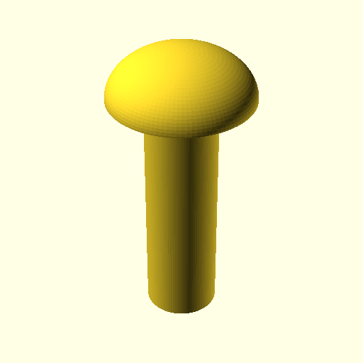
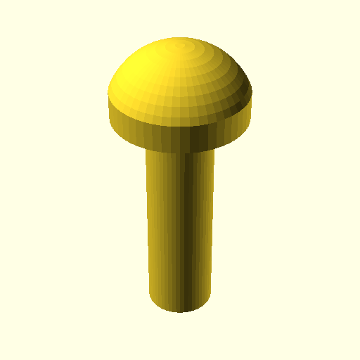
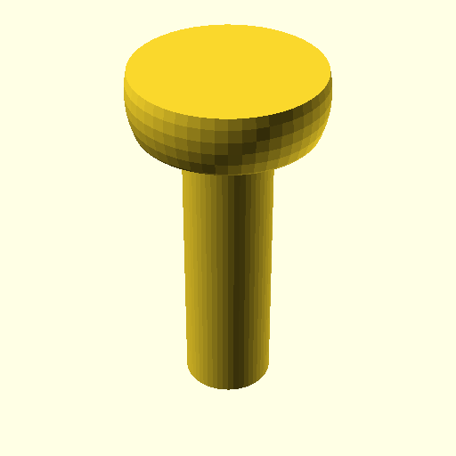
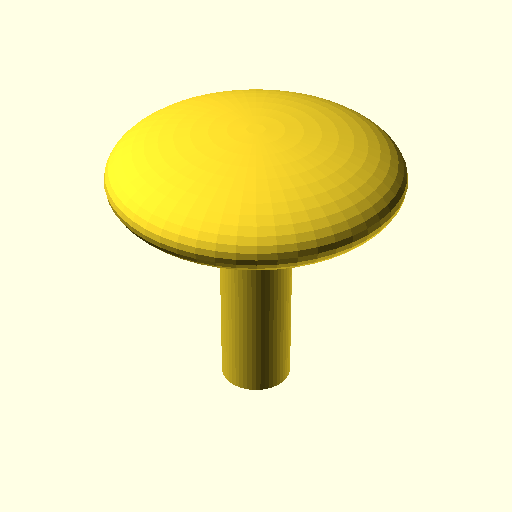
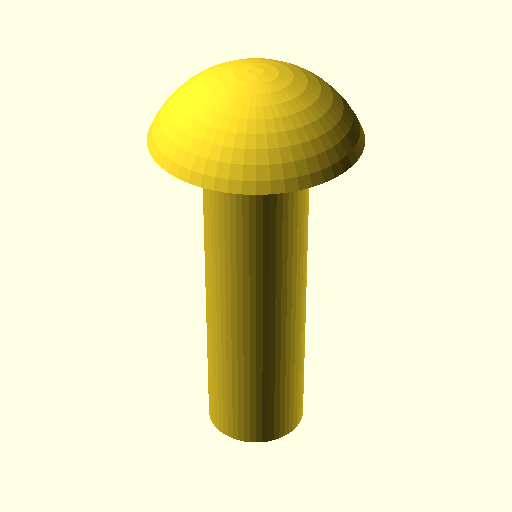
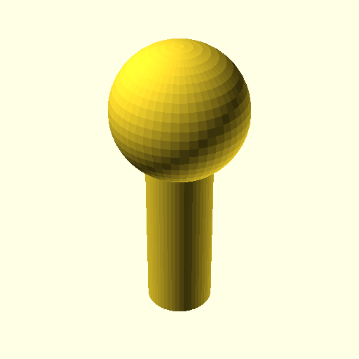
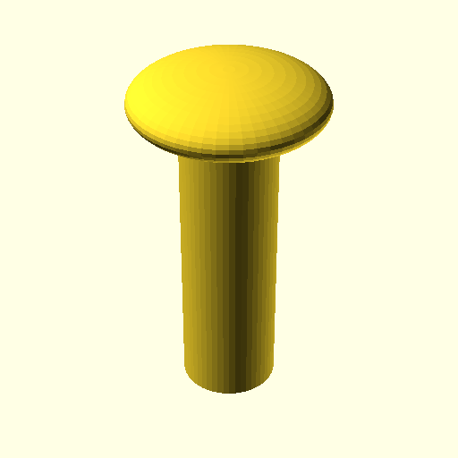

# 3D Model Evaluation Kit

A framework for evaluating language model capabilities in generating 3D models using OpenSCAD.

## Overview

This project provides a structured way to test how well language models can:
- Generate valid OpenSCAD code
- Follow mechanical specifications
- Create 3D models that match given dimensions

## Prerequisites

- [Bun](https://bun.sh) runtime
- [OpenSCAD](https://openscad.org) CLI tool (for rendering validation)
- OpenRouter API key

## Installation

```bash
# Install dependencies
bun install

# Set your OpenRouter API key
export OPENROUTER_API_KEY=your-api-key-here
```

## Usage

### Run all evaluation tasks

```bash
bun run index.ts <model-name>
```

Example:
```bash
bun run index.ts anthropic/claude-4.5-sonnet
```

### Run a specific task

```bash
bun run index.ts <model-name> <task-name>
```

Example:
```bash
bun run index.ts anthropic/claude-4.5-sonnet rivet
```

## Available Tasks

Currently available evaluation tasks:

- **rivet** - Generate a round head rivet with specific dimensions

See [evals/README.md](evals/README.md) for detailed task documentation and how to create new tasks.

## Project Structure

```
.
├── index.ts              # Main entry point
├── src/
│   ├── runner.ts         # Evaluation orchestration
│   ├── tools.ts          # Tool definitions for models
│   ├── types.ts          # TypeScript type definitions
│   └── utils.ts          # Utility functions (OpenSCAD rendering)
├── evals/
│   ├── tasks/            # Task definitions
│   │   ├── index.ts      # Task registry
│   │   └── rivet.ts      # Example task
│   └── results/          # Output directory (gitignored)
└── tests/                # Test files
```

## Development

```bash
# Build the project
bun run build

# Run tests
bun test
```

## Output

Evaluation results are stored in `evals/results/` with the following structure:

```
evals/results/run-YYYYMMDD-HHMMSS-{model-name}/
└── {task-name}/
    ├── *.scad           # Generated OpenSCAD files
    ├── *-bottom.png     # Bottom isometric view rendering
    └── *.png            # Default view rendering
```

Each task generates:
- **OpenSCAD source** - The code generated by the LLM
- **Default view PNG** - Standard rendering using OpenSCAD's autocenter/viewall
- **Bottom isometric PNG** - Fixed camera angle (rotation: -35.264°, 0°, 45°) for consistent evaluation

## Evaluation Results

### 2026-01-13: Rivet Task (Zero-shot)

Evaluation of 8 multimodal models on the rivet generation task.

| Model | Task | Preview |
|-------|------|----------|
| google/gemini-3-flash-preview | rivet |  |
| z-ai/glm-4.6v | rivet |  |
| openai/gpt-5.2 | rivet |  |
| x-ai/grok-4.1-fast | rivet |  |
| anthropic/claude-sonnet-4.5 | rivet |  |
| anthropic/claude-opus-4.5 | rivet |  |
| qwen/qwen3-vl-235b-a22b-instruct | rivet |  |
| mistralai/mistral-large-2512 | rivet |  |

## Models planned for evaluation

The primary criterion of choice is multimodal input with images as a source.

We may later switch to combinations of models - one to generate code and another to check renders.

- google/gemini-3-flash-preview ✅
- z-ai/glm-4.6v ✅
- openai/gpt-5.2 ✅
- x-ai/grok-4.1-fast ✅
- anthropic/claude-sonnet-4.5 ✅
- anthropic/claude-opus-4.5 ✅
- qwen/qwen3-vl-235b-a22b-instruct ✅
- mistralai/mistral-large-2512 ✅

Other models to consider:

- google/gemini-3-pro-image-preview
- qwen/qwen3-vl-32b-instruct
- qwen/qwen3-vl-30b-a3b-thinking
- qwen/qwen3-vl-235b-a22b-thinking

## License

MIT
